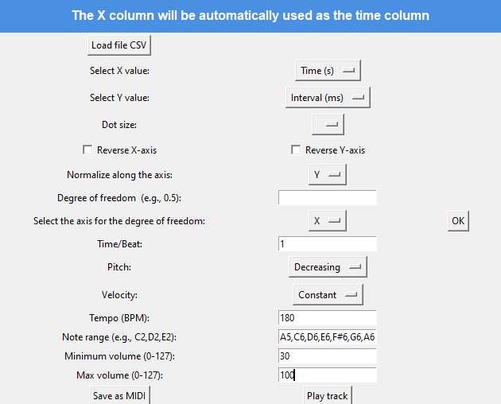

# Simple Sonification Tool

To better understand sonification, I created a tool with a simple graphical interface for sonifying numerical data.  

## Table of Contents

- [Project Description](#project-description)
- [File Structure and Libraries](#file-structure-and-libraries)
- [Example Use Case](#example-use-case)
- [See also](#see-also)

## Project Description

   
  <b>Figure 1 - Program screenshot</b>

The application consists of two main panels: **the settings panel** and **the plot panel**, allowing intuitive management of input data and customization of the musical piece's parameters. If incorrect data is provided, an error message is displayed with appropriate guidance.  

<table align="center" style="border-collapse: collapse; border: none;">
  <tr>
    <td align="center" style="border: none;">
       
      <b>Figure 2 - Settings panel</b>
    </td>
    <td align="center" style="border: none;">
       
      <b>Figure 3 - Plot panel</b>
    </td>
  </tr>
</table>

### Input Data Handling
- **Loading CSV files** – done via the **Load CSV** button and selecting a `.csv` file.  
- **Column selection menu** – dynamically generated based on the columns in the selected `.csv` file.  

### Data Visualization
- Ability to select a column defining the size of the dots on the chart.  
- Option to flip the chart along the X and Y axes for better view adjustment. 

### Normalization and Degree of Freedom
- To normalize data along a selected axis, simply choose the desired axis in the dedicated field.  
- The user can apply nonlinear scaling with an adjustable degree of freedom, allowing for compression or expansion of data along the chosen axis.  

### Track Properties
- To determine the track length in beats, select the appropriate conversion marker (**Time/beat** field) and divide it by the highest value in the column corresponding to track length.  
- To set how note pitch depends on values, choose an option in the **Pitch** menu:
  - **Increasing** – higher value = lower pitch.  
  - **Decreasing** – higher value = higher pitch.  
- To set how note volume depends on values, choose an option in the **Velocity** menu:
  - **Increasing** – higher value = louder note.  
  - **Decreasing** – higher value = quieter note.  
  - **Fixed level** – volume remains unchanged, always set to the value in the **Max volume** field.  
- User can set the **BPM** value (default: 60).  
- Define the note range and set the minimum and maximum volume in the **Min volume** and **Max volume** fields (0-127, MIDI format).  

### MIDI File Generation and Playback
- **Save as MIDI** – the **Save as MIDI** button opens a window to enter the file name and saves the result.  
- **Play Track** – the **Play Track** button opens a window to select a MIDI file and plays it.    

## File Structure and Libraries

The application uses the following libraries:

- **User Interface**: `Tkinter`
- **Data Processing**: `Pandas`
- **Visualization**: `Matplotlib`
- **Audio Processing**: `MIDIUtil`, `Pygame`

### File Structure

- **`mapping.py`** – functions for mapping values:
  - `map_range` – maps values from an input array to a new range, returning floating-point results.
  - `map_data` – maps values from an input list to a new range, optionally reversing the mapping, and returns a list of rounded integers.

- **`mid.py`** – note conversion:
  - `str2midi` – converts a note name to a MIDI number.
  - `midi2str` – converts a MIDI number to a note name.

### Main Application Functions

#### **Loading and Processing Data**
- `load_csv()` – loads data from a CSV file.
- `update_choice(axis, value)` – updates the value selection for the chosen axis and refreshes normalization.
- `apply_axis_reversal()` – reverses values on the X and Y axes.
- `apply_normalization()` – normalizes values to the range `[0,1]`.
- `apply_power()` – transforms values using the degree of freedom.
- `calculate_bit_data()` – calculates note durations based on a selected column.

#### **User Interface**
- `create_widgets()` – creates interface elements like buttons and menus.
- `configure_grid()` – dynamically scales and adjusts the window layout.

#### **Generating and Playing MIDI Files**
- `save_midi()` – saves data to a MIDI file.
- `play_midi()` – plays a MIDI file using `pygame`.

#### **Data Visualization**
- `update_plot()` – draws a plot with normalization and transformations applied.

## Example Use Case

### Sonification of Heartbeat Data

This example converts sequential heartbeat data into sound, making anomalies easier to detect.  

Sonification assumptions:  
- **Measurement time** → determines the length of the generated track.  
- **Heartbeat interval (time between beats)** → determines pitch:  
  - Longer intervals → **higher pitch**,  
  - Shorter intervals → **lower pitch**.  
- **Fixed volume** → to maintain clarity of the sound.  

In this way, **both too large and too small intervals** will be heard as deviations from the norm.  

<table align="center" style="border-collapse: collapse; border: none;">
  <tr>
    <td align="center" style="border: none;">
       
      <b>Figure 4 - Settings panel after importing data</b>
    </td>
    <td align="center" style="border: none;">
       
      <b>Figure 5 - Plot panel after importing data</b>
    </td>
  </tr>
</table>

---

### 1. Scaling the Data
Since the data is already in the correct range, **we do not apply**:  
- **Reversing values on the X and Y axes**,  
- **Stretching values**,  
- **Modifying the range with the degree of freedom**.  

All **checkboxes remain unchecked**, and the **Degree of freedom** field is left empty.

---

### 2. Musical Settings
To obtain a sonically comfortable representation of the heartbeat in sound, we apply:  
- **Tempo = 180 BPM** → this **BPM** shortens gaps between notes, making the data easier and faster to analyze.

---

### 3. Note Range and Volume
Now define volume settings and select a **note range** (this range is flexible, but I chose the following):  
 
`C1, E2, F2, A2, C3, D3, G3, B3, D4, F4, A4, B4, D5, G5, A5, C6, D6, E6, F#6, G6, A6`  

This range covers a wide spectrum of pitches, effectively highlighting variations in heartbeat rhythm.

The volume is **fixed**, making changes in tone more distinguishable without interference from loudness variations.

---

### 4. Saving and Playing the Track
After setting all parameters:  
1. **Save the result** as a MIDI file for further analysis.  
2. **Play the track** manually or using the **play track** button.

<table align="center" style="border-collapse: collapse; border: none;">
  <tr>
    <td align="center" style="border: none;">
       
      <b>Figure 6 - Settings panel after applying all transformations</b>
    </td>
    <td align="center" style="border: none;">
       
      <b>Figure 7 - Plot panel after applying all transformations</b>
    </td>
  </tr>
</table>

## See also
- [sonification-tutorials](https://github.com/SYSTEMSounds/sonification-tutorials?tab=readme-ov-file)

- 
